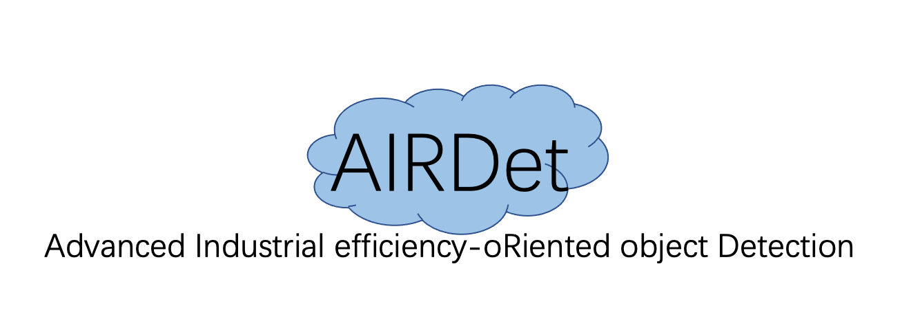

[English](README.md) | 简体中文 

<div align="center"></div>

## 简介
欢迎来到AIRDet！AIRDet是一个面向工业落地的目标检测框架，目的是针对复杂多变的工业场景提供开箱即用的目标检测能力。结合学术界的突破和我们在工业落地上的经验，AIRDet-s在精度上超越了目前的一众YOLO(YOLOX-s, YOLOv6-s, YOLOe-s)，并且仍然保持极高的推理速度。除了业界领先的检测模型，AIRDet还提供高效的训练策略以及便捷易用的部署工具，帮助您快速解决工业落地中的实际问题！

## 更新日志
-  **[2022/06/23: AIRDet-0.0.1开源!]**
    * 开源AIRDet-s以及AIRDet-m模型，其中AIRDet-s在COCO val集上mAP达到44.2%，推理latency仅有2.8ms。此外，我们以AIRDet-s为基准，借助heavy neck范式构建了AIRDet-m，实现了性能突破。更多关于heavy neck范式的细节请参考[Giraffe-neck](https://arxiv.org/abs/2202.04256).
    * 开源模型转换工具，支持onnx导出以及TensorRT-fp32、TensorRT-fp16模型转换。

## 即将来临
- 更多高效的骨干网络(backbone)。
- AIRDet-tiny以及AIRDet-nano。
- 模型蒸馏策略。 


## 模型库
|Model |size |mAP<sup>val<br>0.5:0.95 | Latency V100<br>TRT-FP32-BS32| Latency V100<br>TRT-FP16-BS32| FLOPs<br>(G)| weights |
| ------        |:---: | :---:     |:---:|:---: | :---: | :----: |
|[Yolox-s](./configs/yolox_s.py)   | 640 | 40.5 | 3.4 | 2.3 | 26.81 | [link]() |
|[AIRDet-s](./configs/airdet_s.py) | 640 | 44.2 | 4.4 | 2.8 | 27.56 | [提取码ww2u](https://pan.baidu.com/s/1YjOPxIP-p4-5OxdkYlvpug) |
|[AIRDet-m](./configs/airdet_m.py) | 640 | 48.2 | 8.3 | 4.4 | 76.61 | [提取码mg2l](https://pan.baidu.com/s/13Ux4fFed-nd_3wmSIt66RA) |

- 上表中汇报的是COCO2017 val集上的结果。
- latency中不包括后处理时间。

## 快速上手

<details>
<summary>安装</summary>

步骤一.  安装AIRDet.
```shell
git clone https://github.com/tinyvision/AIRDet.git
cd AIRDet/
conda create -n AIRDet python=3.7 -y
conda activate AIRDet
conda install pytorch==1.7.0 torchvision==0.8.0 torchaudio==0.7.0 cudatoolkit=10.2 -c pytorch
pip install -r requirements.txt
export PYTHONPATH=$PWD:$PYTHONPATH
```
步骤二. 安装[pycocotools](https://github.com/cocodataset/cocoapi).

```shell
pip3 install cython; 
pip3 install 'git+https://github.com/cocodataset/cocoapi.git#subdirectory=PythonAPI'
```
</details>

<details>
<summary>Demo</summary>

步骤一. 从模型库中下载训练好的模型，例如airdet-s.

步骤二. 执行命令时用-f选项指定配置(config)文件。例如:
```shell
python tools/demo.py -f configs/airdet_s.py --ckpt /path/to/your/airdet_s.pth --path assets/dog.jpg
```
</details>

<details>
<summary>从头开始，复现COCO上的精度</summary>

步骤一. 准备好COCO数据集,推荐将coco数据软链接到datasets目录下。
```shell
cd <AIRDet Home>
ln -s /path/to/your/coco ./datasets/coco
```

步骤二. 在COCO数据上进行训练，使用-f选项指定配置(config)文件。
```shell
python -m torch.distributed.launch --nproc_per_node=8 tools/train.py -f configs/airdet_s.py
```
</details>

<details>
<summary>在COCO val上测评训练好的模型</summary>

```shell
python -m torch.distributed.launch --nproc_per_node=8 tools/eval.py -f configs/airdet_s.py --ckpt /path/to/your/airdet_s_ckpt.pth
```
</details>

<details>
<summary>使用自定义数据集训练AIRDet</summary>
AIRDet目前支持COCO格式和VOC格式,在我们的默认设置中使用的是COCO格式。如果您需要使用VOC格式,下面是一个简单的教程供您参考。


步骤一. 按照VOC的目录结构组织好图片和标注信息,其目录结构看起来是这个样子。

```shell script
Bus/
    Annotations/
        *.xml
    JPEGImages/
        *.jpg,png,PNG
    ImageSets/
        Main/
            train.txt
            test.txt
            val.txt
```

步骤2. 在配置文件中加入数据名以及对应的存放路径, 数据命名需要遵循【数据名_custom_train/val】。
```shell script
self.dataset.train_ann = ("bus_custom_train",)
self.dataset.val_ann = ("bus_custom_val")
self.dataset.data_dir = 'datasets'
self.dataset.data_list = {
    "bus_custom_train": {
        "data_dir": "Bus/",
        "split": "train"
    },
    "bus_custom_val": {
        "data_dir": "Bus/",
        "split": "val"
    }, 
}

self.dataset.class2id = {
    'class_name1': 1,
    'class_name2': 2,
    'class_name3': 3,
}
self.model.head.num_classes = len(self.dataset.class2id.keys())
```

步骤3. 将您的数据软链接到`$AIRDet/datasets`目录下。
```shell script
ln -s /path/to/your/Bus/ ./datasets/Bus/
```

步骤4. 创建您的config文件配置训练和验证参数，例如bus_s.py，开始训练！
```
python -m torch.distributed.launch --nproc_per_node=8 tools/train.py -f configs/bus_s.py
```
</details>

## 部署

<details>
<summary>Installation</summary>

步骤1. 安装 ONNX.
```shell
pip install onnx==1.8.1
pip install onnxruntime==1.8.0
pip install onnx-simplifier==0.3.5
```
步骤2. 安装 CUDA、CuDNN、TensorRT and pyCUDA
2.1 CUDA
```shell
wget https://developer.download.nvidia.com/compute/cuda/10.2/Prod/local_installers/cuda_10.2.89_440.33.01_linux.run
sudo sh cuda_10.2.89_440.33.01_linux.run
export PATH=$PATH:/usr/local/cuda-10.2/bin
export LD_LIBRARY_PATH=$LD_LIBRARY_PATH:/usr/local/cuda-10.2/lib64
source ~/.bashrc
```
2.2 CuDNN
```shell
sudo cp cuda/include/* /usr/local/cuda/include/
sudo cp cuda/lib64/libcudnn* /usr/local/cuda/lib64/
sudo chmod a+r /usr/local/cuda/include/cudnn.h
sudo chmod a+r /usr/local/cuda/lib64/libcudnn*
```
2.3 TensorRT
```shell
cd TensorRT-7.2.1.6/python
pip install tensorrt-7.2.1.6-cp37-none-linux_x86_64.whl
export LD_LIBRARY_PATH=$LD_LIBRARY_PATH:TensorRT-7.2.1.6/lib
```
2.4 pycuda
```shell
pip install pycuda==2022.1
```
</details>

步骤一. 将训练好的模型转换成onnx或者trt格式，目前支持三种选项【onnx, trt_32, trt_16】，转换好的模型会保存在deploy目录下。
```shell script
python tools/converter.py --output-name deploy/airdet_s.onnx -f configs/airdet_s.py -c airdet_s.pth --batch_size 1 --img_size 640 --mode trt_32
```
步骤二. 转换后的TRT模型精度验证以及测速。
```shell script
python -m torch.distributed.launch --nproc_per_node=1 tools/trt_eval.py -f configs/airdet_s.py --trt deploy/airdet_s_32.trt --batch_size 1 --img_size 640
```
Step.3 使用TRT模型进行图片推理.
```shell script
python tools/trt_inference.py -f configs/airdet_s.py -t deploy/airdet_s_32.trt -p assets/dog.jpg --img_size 640 --nms 0.7
```

